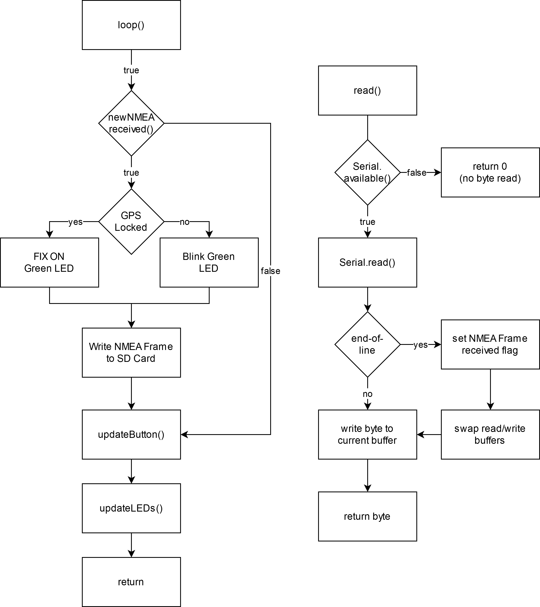

Ionik
=====

Ionik Block Diagram
-------------

**Figure 1** – *Block diagram of the Arduino-based ionospheric monitor.*

The main components of the developed module are outlined in the block diagram show in Figure 1. The whole system can be powered by either a 9V battery or single 5V power supply connected through the USB port of the Arduino board (which then powers the Adafruit GPS Receiver). A bidirectional serial RS-232 communication link is stablished between the GPS module and the Arduino board through its pins 0 and 1, which feature the dedicated on-board USART chip. Finally, the SD Card shield is mounted on top of the Arduino board, allowing it to write to the SD card through the SPI protocol and internal libraries available in the Arduino Standard Library.

The code loaded on the Arduino can be found in the present GitHub repository. The code is implemented in the C programming language and makes use only of the Arduino Standard Library, with no other external dependencies. The library provided by the GPS receiver manufacturer, Adafruit, intended for integrating the module with the Arduino board, is not needed. All the necessary calls to interface with GPS module are reimplemented from scratch in as stripped-down versions, as to not bloat the already limited Arduino program memory and implement exactly the needed functionality.

High Level Code Flow
--------------------

**Figure 2** – *High-level flow diagram of the code running in the Arduino.*

The code is comprised of two processes. The main process is shown on the left side of Figure 2, composed of the usual `setup()` and `loop()` functions, which are called by the Arduino bootloader once the board is reset. The `setup()` code is only ran once and is responsible for initializing all the registers and memory states necessary for the future board operation. Then, once the initialization is done, the `loop()` code is repeatedly run as often as the microcontroller is able to process it. The `loop()` code is responsible for storing the NMEA GPS frames in the SD Card as soon as they are received in an internal buffer, as well as reading the button state and updating the LED states.

Concurrently, an interrupt signal is set up to fire in 1 millisecond intervals, calling the `read()` code, as shown on the right side of Figure 1. The `read()` code is responsible for reading bytes received by the serial RS-232 link (which were transmitted by the GPS module) and storing them in an internal buffer for each complete NMEA frame received. Once the `read()` code has no more bytes to read, the regular main `loop()` code is resumed.

This two-process setup was essential to prevent data loss due to not reading from the serial port frequently enough. The Arduino buffer includes a dedicated USART chip, but its buffer can only hold data for a very limited amount of time at the relatively high data transmission rates the board is operating at. The interrupt process was essential to read the all the available data from the USART chip in regular intervals so all data transmitted by the GPS module to be consistently received without any
losses.

`loop()` and `read()` Code Flow
--------------------

As mentioned before, the `loop()` code is executed as often as it able to be ran by the microcontroller. The left panel of Figure 3 shows its detailed code flow diagram. This process is responsible for controlling the main behavior of the board, such as controlling the LEDs, writing received NMEA frames to the SD Card and reading the button state.

The `read()` function is called every 1 millisecond by the interrupt signal, reads any available bytes received by the serial USART chip and stores it in memory accessible by the C program, as show in the right panel of Figure 3. When an end-of-line character is read, the board has received a full NMEA frame, and a flag is set so the `loop()` code reads the received frame on its next execution. The `read()` code employs a double-buffering strategy: two buffers of equal size are allocated and alternate between themselves in read and write functions. That is, while one buffer is being written at by the `read()` code, the other one is read by the `loop()` code, as to not overlap read and write operations in the same buffer which could lead to data racing issues. With this strategy, swapping the role of the buffers is a simple and fast pointer swap, instead of a full sequential memory copy.
